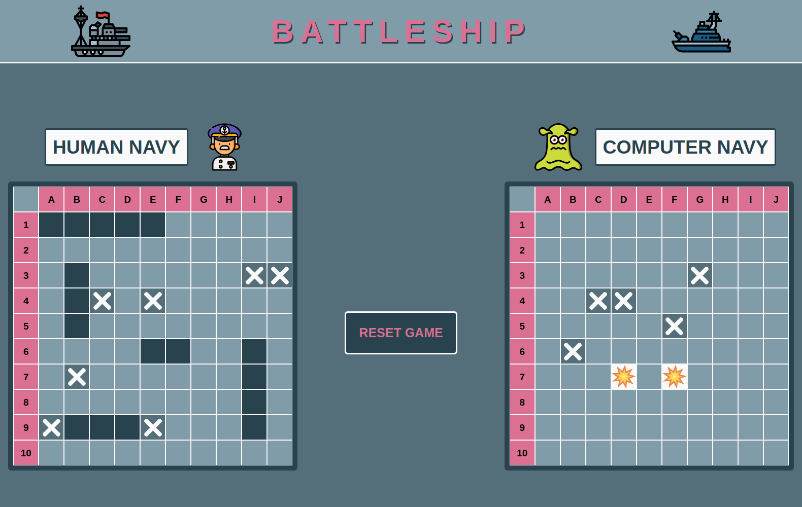
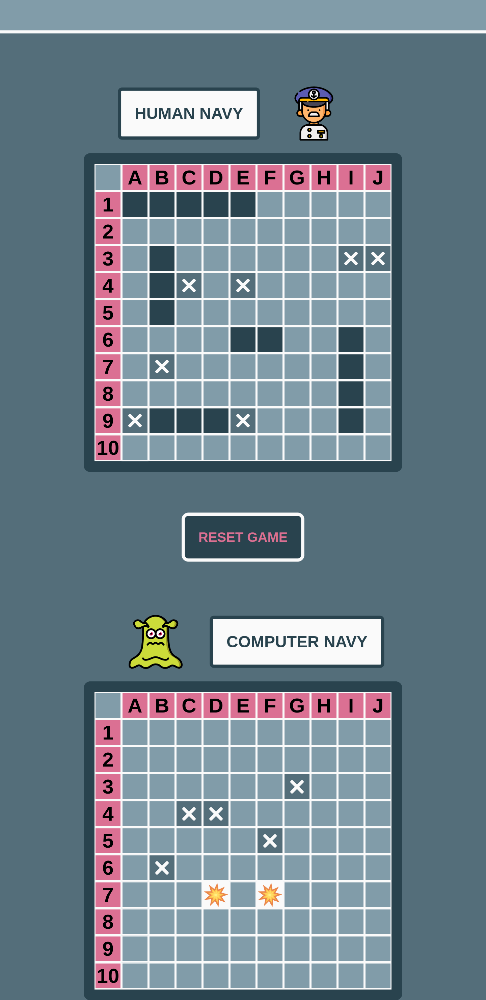

<!--
*** Useful links for the README.md file's redaction
*** https://shields.io/ - Shields
*** https://www.webfx.com/tools/emoji-cheat-sheet/ - Emojis
*** https://github.com/othneildrew/Best-README-Template - General Inspiration for this file 
-->


<!-- PROJECT SHIELDS -->
<!--
*** Reference links are enclosed in brackets [ ] instead of parentheses ( ).
*** See the bottom of this document for the declaration of the reference variables
*** This is an optional, concise syntax you may use.
*** https://www.markdownguide.org/basic-syntax/#reference-style-links
*** It is possible to use a personal logo, as for the Personal Website shield :
*** Convert the logo to base 64 (https://b64.io/), then include it as explained on
*** https://shields.io/.
-->

[![Personal Website][personal-website-shield]][personal-website-url]
[![LinkedIn][linkedin-shield]][linkedIn-url]
[![MIT License][license-shield]][license-url]


<br/>
<!-- PROJECT LOGO -->
<br/>
<p align="center">
    <a href="https://banaanas.github.io/battleship-TOP/">
        
    </a>
</p>

<h1 align="center">:medal_military: Battleship :bomb:</h1>

<p align="center">
    Nice and funny BattleShip Game.<br/><br/>
    <a href="https://banaanas.github.io/battleship-TOP/">:computer: Live Demo :eyes:</a><br/><br/>
</p>


<!-- TABLE OF CONTENTS -->

## Table of Contents

- [About the Project](#about-the-project)
  - [Principal Features](#principal-features)
  - [Built With](#built-with)
- [Getting Started](#getting-started)
  - [Prerequisites](#prerequisites)
  - [Installation](#installation)
- [License](#license)
- [Contact](#contact)

<!-- TABLE OF CONTENTS -->

## About the Project
Battleship Game achieved as part of <a href="https://www.theodinproject.com/courses/javascript/lessons/battleship">The Odin Project - JavaScript curriculum</a>.
One important 

<p align="center">
  <a href="https://banaanas.github.io/battleship-TOP/">
    
  </a>
</p>


#### Principal Features
- Human Player vs. Computer Player ;
- Manual ship placement (Human Player) ;
- Random ship placement (Computer Player) ;
- Great User Interface ;
- Responsive design.

<p align="center">
  <a href="https://banaanas.github.io/battleship-TOP/">
    
  </a>
</p>

#### Built With

- [Vanilla JavaScript](http://vanilla-js.com/)

ES6 - Factory Functions - Random Ship Placement algorithm - Async / Await

Test-Driven Development (TDD) - Jest
- [HTML5](https://www.w3.org/html/)
- [CSS3](https://www.w3.org/Style/CSS/Overview.html)

Grid - Flexbox - Media Queries

- [Jest](https://jestjs.io/)
- [Webpack](https://webpack.js.org/)
- [Babel](https://babeljs.io/)
- [core-js](https://github.com/zloirock/core-js)
- [ESLint](https://eslint.org/)
- [stylelint](https://stylelint.io/)


<!-- GETTING STARTED -->

## Getting Started

#### Prerequisites

- Node.js
- NPM - Node Package Manager

```sh
npm install npm@latest -g
```

#### Installation

1 - Clone the Project's repository

```sh
git clone https://github.com/your_username_/Project-Name.git
```

2 - Install NPM Packages / Dependencies

```sh
npm install
```

3 - Development Server
```sh
npm start
```

4 - Production build
```sh
npm run build
```


<!-- LICENSE -->

## License

Distributed under the MIT License. See <a href="./LICENCE.txt">`LICENSE`</a> for more information.


<!-- CONTACT -->

## Contact

Cyrilo - [Personal Website](https://yetToCome) - cyrildeveloppeur@gmail.com

Project Link: [https://github.com/Banaanas/battleship-TOP](https://github.com/Banaanas/battleship-TOP)


<!-- ACKNOWLEDGEMENTS -->

## Acknowledgements

- [The Odin Project](https://www.theodinproject.com/)
- [GitHub Pages](https://pages.github.com)
- [Flaticon](https://www.flaticon.com/)

<!-- MARKDOWN LINKS & IMAGES -->

[personal-website-shield]: https://img.shields.io/badge/-Personal_Website-9370DB?style=flat&logo=data:image/svg+xml;base64,PD94bWwgdmVyc2lvbj0iMS4wIiBlbmNvZGluZz0iaXNvLTg4NTktMSI/PjxzdmcgdmVyc2lvbj0iMS4xIiBpZD0iQ2FwYV8xIiB4bWxucz0iaHR0cDovL3d3dy53My5vcmcvMjAwMC9zdmciIHhtbG5zOnhsaW5rPSJodHRwOi8vd3d3LnczLm9yZy8xOTk5L3hsaW5rIiB4PSIwcHgiIHk9IjBweCIgdmlld0JveD0iMCAwIDUxMi4wMDEgNTEyLjAwMSIgc3R5bGU9ImVuYWJsZS1iYWNrZ3JvdW5kOm5ldyAwIDAgNTEyLjAwMSA1MTIuMDAxOyIgeG1sOnNwYWNlPSJwcmVzZXJ2ZSI+PGc+PGc+PHBhdGggZD0iTTUwMy40MDIsMjI4Ljg4NUwyNzMuNjg0LDE5LjU2N2MtMTAuMDgzLTkuMTg5LTI1LjI4OC05LjE4OC0zNS4zNjctMC4wMDFMOC41OTgsMjI4Ljg4NmMtOC4wNzcsNy4zNi0xMC43NDUsMTguNy02Ljc5OSwyOC44ODljMy45NDcsMTAuMTg5LDEzLjU1NywxNi43NzIsMjQuNDg0LDE2Ljc3MmgzNi42OXYyMDkuNzIxYzAsOC4zMTUsNi43NDIsMTUuMDU3LDE1LjA1NywxNS4wNTdoMTI1LjkxNGM4LjMxNSwwLDE1LjA1Ny02Ljc0MSwxNS4wNTctMTUuMDU3VjM1Ni45MzJoNzQuMDAydjEyNy4zMzdjMCw4LjMxNSw2Ljc0MiwxNS4wNTcsMTUuMDU3LDE1LjA1N2gxMjUuOTA4YzguMzE1LDAsMTUuMDU3LTYuNzQxLDE1LjA1Ny0xNS4wNTdWMjc0LjU0N2gzNi42OTdjMTAuOTI2LDAsMjAuNTM3LTYuNTg0LDI0LjQ4NC0xNi43NzJDNTE0LjE0NywyNDcuNTg1LDUxMS40NzksMjM2LjI0Niw1MDMuNDAyLDIyOC44ODV6IiBmaWxsPSIjZjhmOGZmIi8+PC9nPjwvZz48Zz48Zz48cGF0aCBkPSJNNDQ1LjA5Miw0Mi43M0gzNDMuOTczbDExNi4xNzYsMTA1LjYzNnYtOTAuNThDNDYwLjE0OSw0OS40NzEsNDUzLjQwOCw0Mi43Myw0NDUuMDkyLDQyLjczeiIgZmlsbD0iI2Y4ZjhmZiIvPjwvZz48L2c+PGc+PC9nPjxnPjwvZz48Zz48L2c+PGc+PC9nPjxnPjwvZz48Zz48L2c+PGc+PC9nPjxnPjwvZz48Zz48L2c+PGc+PC9nPjxnPjwvZz48Zz48L2c+PGc+PC9nPjxnPjwvZz48Zz48L2c+PC9zdmc+
[personal-website-url]: https://myLink
[linkedin-shield]: https://img.shields.io/badge/-LinkedIn-blue?style=flat&logo=linkedin&
[linkedin-url]: https://linkedin.com/mylink
[license-shield]: https://img.shields.io/badge/License-MIT-limegreen.svg
[license-url]: ./LICENCE.txt
